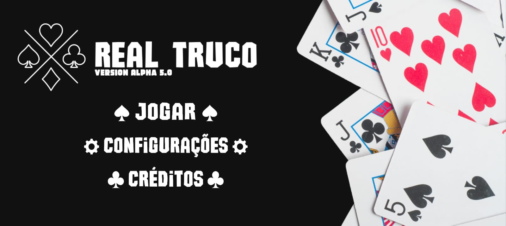
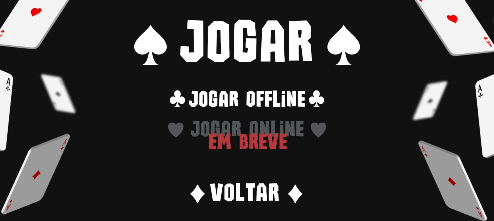
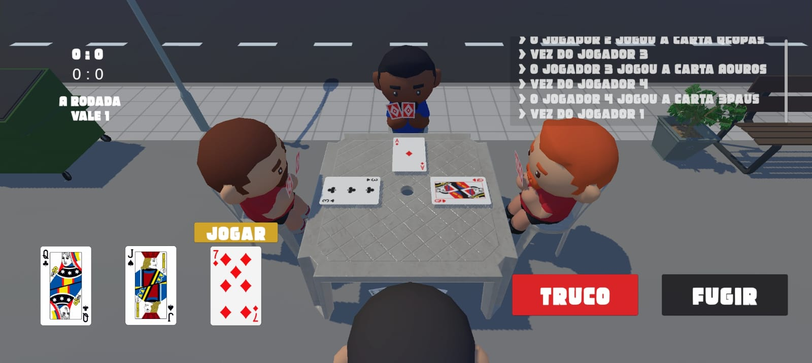

# 🎴 Real Truco - Jogo Mobile de Truco

**Real Truco** é um jogo mobile de **Truco Mineiro** desenvolvido em **Unity** com **C#**, criado durante o meu ensino médio no IFTM como uma forma de aprender, de forma autodidata, os fundamentos de **programação orientada a objetos (POO)** e **desenvolvimento de jogos**.  
Mesmo sem formação na área de Game Dev na época, esse projeto representou meu esforço em explorar e me aprofundar nesse universo.

## ⚠️ Importante

Infelizmente, perdi o HD com a versão mais atual do projeto.  
O que está neste repositório é uma **versão antiga e primitiva**, originalmente usada apenas como backup (o versionamento principal era feito via sistema da Unity).

Apesar disso, mantive o projeto aqui por valor histórico e como prova do meu interesse pela área.

> 💾 Há também um **APK funcional da versão mais recente** disponível aqui no repositório, caso tenha interesse em testar o jogo.

## 🚀 Motivação

Sempre gostei de aprender por conta própria, e o **Real Truco** foi minha primeira grande iniciativa nesse sentido.  
Foi através dele que estudei tópicos como:

- Criação de interface com o usuário (UI)
- Lógica de jogo e regras do Truco
- Manipulação de estados e cenas
- Estruturação de código em C#

## 📦 Recursos disponíveis no repositório

- Código-fonte da versão antiga (com estrutura ainda monolítica)
- Build APK da última versão funcional
- Imagens e GIFs do jogo em ação 

## 🧠 Lições aprendidas

- Importância do versionamento contínuo e organizado (especialmente fora da Unity Cloud)
- Valor de ter backups regulares
- Como a prática com projetos pessoais pode acelerar o aprendizado

## 📱 Plataforma-alvo

- **Android** (Mobile)

## 📌 Observação final

Apesar das limitações desta versão, ela ainda representa uma etapa importante da minha jornada. Estou muito animado para continuar aprendendo mais sobre Game Dev e explorar novos projetos nessa área.

## Imagens

---

**Obrigado por visitar este repositório! Se quiser conversar mais sobre o projeto ou sobre Game Dev em geral, fico à disposição.**
